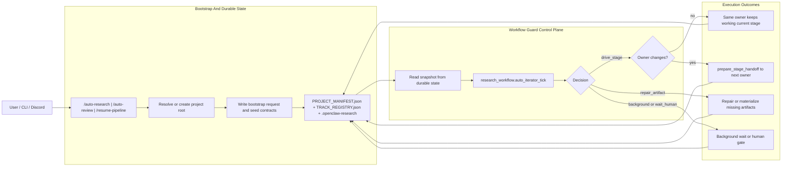

# ClawAutoResearch

`ClawAutoResearch` 是 OpenClaw 上的自动科研控制平面。它不是单个“会写论文的 Agent”，而是一套围绕 durable state、workflow guard、graph presence、阶段合同和多角色 handoff 组织起来的科研执行系统。

系统的权威介绍仍然在 [`docs/`](./docs/README.md)，但如果你想先理解这个仓库当前真实实现的 `/auto-research` 和 `/auto-review` 流程，这个 README 先给出最短入口和两条主线的流程图。

## 文档入口

- [Docs Portal Source](./docs/index.md)
- [Docs Map](./docs/README.md)
- [Project Lifecycle](./docs/get-started/project-lifecycle.md)
- [Workflow Control Plane](./docs/architecture/workflow-control-plane.md)
- [Auto Research / Auto Review Handoffs](./docs/architecture/auto-pipeline-handoffs.md)
- [Commands & Tools](./docs/reference/commands-and-tools.md)

## 两条自动主线

| 入口 | 目标 | 主阶段 | 不会走的路径 | 关键 durable state |
| --- | --- | --- | --- | --- |
| `/auto-research "topic"` | 实验论文主线 | `setup -> graph_build -> frontier_mapping -> idea -> plan -> code -> experiment -> analyze -> review -> write -> submit` | 不会跳过 graph / ideation / planning 直接写论文 | `PROJECT_MANIFEST.json`、`TRACK_REGISTRY.json`、`researcher/EXPERIMENT_LEDGER.json`、`.openclaw-research/` |
| `/auto-review "topic"` | 科研综述主线 | `setup -> survey_review -> write -> submit` | 正常不会进入 `plan -> code -> experiment` | `PROJECT_MANIFEST.json.survey_review`、`researcher/SURVEY_BRIEF.md`、`.openclaw-research/` |

## 共享控制平面

两条主线共用同一套控制逻辑。命令负责 bootstrap，真正决定推进、回退、repair 和 handoff 的是 `research_workflow.auto_iterator_tick`。



这意味着：

- `/auto-research` 和 `/auto-review` 只是启动器，不是状态机本身。
- Discord 现在主要是通知通道，不再是这两个入口的必需项目绑定来源。
- 恢复统一走 `/resume-pipeline`，或者先看 snapshot 再重新跑 `auto_iterator_tick`。

## Auto Research

`/auto-research "topic"` 会创建或复用项目目录，写入 bootstrap request、初始 `research_program` / `writing_contract` / `graph_guided_writing`，然后启动后台 `research_pipeline`。之后系统沿实验论文主线推进。

```mermaid
flowchart LR
    subgraph B["Bootstrap"]
        A["/auto-research topic"] --> B1["Create or reuse project"]
        B1 --> B2["Persist bootstrap request and onboarding placeholders"]
        B2 --> B3["Seed research_program, writing_contract, graph_guided_writing"]
        B3 --> B4["Start background research_pipeline"]
    end

    subgraph R["Researcher"]
        R1["setup"]
        R2["graph_build"]
        R3{"graph presence ready?"}
        R4["queue ingestion or repair graph presence"]
        R5["frontier_mapping"]
        R6["idea"]
        R7["experiment"]
    end

    subgraph O["Orchestrator"]
        O1["plan"]
    end

    subgraph C["Coder"]
        C1["code"]
    end

    subgraph A1["Analyzer"]
        A2["analyze"]
    end

    subgraph V["Reviewer"]
        V1["review"]
        V2["submit-ready review gate"]
    end

    subgraph W["Academic Writer"]
        W1["write"]
    end

    B4 --> R1 --> R2 --> R3
    R3 -- "no" --> R4 --> R2
    R3 -- "yes" --> R5 --> R6
    R6 -->|handoff| O1
    O1 -->|handoff| C1
    C1 -->|handoff| R7
    R7 -->|handoff| A2
    A2 -->|handoff| V1
    V1 -->|handoff| W1
    W1 -->|handoff| V2
```



跨 owner 的关键 handoff 是：

- `idea -> plan`：`researcher -> orchestrator`
- `plan -> code`：`orchestrator -> coder`
- `experiment -> analyze`：`researcher -> analyzer`
- `analyze -> review`：`analyzer -> reviewer`
- `review -> write`：`reviewer -> academic_writer`
- `write -> submit`：`academic_writer -> reviewer`

## Auto Review

`/auto-review "topic"` 会创建 survey 项目，写入 survey-mode `writing_contract` 和 `graph_guided_writing` bootstrap，然后直接启动后台 `survey_review`。这条线围绕 screening、coverage、gap synthesis 和 `SURVEY_BRIEF.md` 推进，不会按实验论文那条线先去 `plan/code/experiment`。

```mermaid
flowchart LR
    subgraph B["Bootstrap"]
        A["/auto-review topic"] --> B1["Create or reuse survey project"]
        B1 --> B2["Persist bootstrap request"]
        B2 --> B3["Seed survey writing_contract and graph_guided_writing"]
        B3 --> B4["Start background survey_review"]
    end

    subgraph R["Researcher"]
        R1["survey_review"]
        R2["retrieval and screening"]
        R3["coverage, taxonomy, representative methods"]
        R4["gap synthesis and SURVEY_BRIEF.md"]
        R5{"survey_review completed?"}
    end

    subgraph W["Academic Writer"]
        W1["write with paper_mode=survey"]
    end

    subgraph V["Reviewer And Human Gate"]
        V1["submit-ready review"]
        V2["final human decision"]
    end

    B4 --> R1 --> R2 --> R3 --> R4 --> R5
    R5 -- "no" --> R2
    R5 -- "yes" -->|handoff| W1
    W1 -->|handoff| V1 --> V2
```

这条线的关键事实是：

- `survey_review` 是 Researcher 持有的主阶段。
- `write` 只会在 survey packet 完整、`SURVEY_BRIEF.md` ready、`survey_review.status=completed` 时进入。
- 最终提交前仍然保留 Reviewer 与人工 gate，不是无条件全自动投稿。

## 本地启动

如果你不想依赖 Discord，可以直接用本地 command harness 启动这两条主线：

```bash
node scripts/run_local_workflow_command.mjs \
  --command auto-research \
  --args '"Generalized Category Discovery"' \
  --projects-root "$HOME/AutoResearchProjects" \
  --channel local
```

```bash
node scripts/run_local_workflow_command.mjs \
  --command auto-review \
  --args '"Generalized Category Discovery survey"' \
  --projects-root "$HOME/AutoResearchProjects" \
  --channel local
```

真实 workflow runtime 的 E2E 验证入口：

```bash
npm run test:autoresearch:real -- --topic "GCD"
npm run test:autoreview:real -- --topic "GCD"
```

live E2E 默认创建带时间戳的隔离项目；需要复用旧项目时加 `--reuse-project` 或 `--project-id <id>`。如果外部 provider quota、gateway bootstrap 或项目目录创建失败，runner 会写出 `.openclaw-research/e2e-runs/.../AUTO_WORKFLOW_E2E_SUMMARY.*` 供复盘。

使用本机 PaperNexus 服务做真实 autoresearch 测试：

```bash
npm run test:autoresearch:real -- \
  --topic "GCD" \
  --use-local-papernexus \
  --papernexus-shared-corpus GCD
```

这个开关读取 `~/.papernexus/config.json`，把当前测试的 PaperNexus access 临时覆盖到本地 HTTP MCP，并只通过进程环境注入 token；summary 不落明文 token。因为 PaperNexus wrapper 默认拒绝 loopback MCP URL，runner 只在显式本地测试时额外注入 `PAPERNEXUS_ALLOW_LOCAL_MCP=1` / `papernexusAllowLocalMcp=true`。如果本机 PaperNexus 有多个 corpus，必须同时传 `--papernexus-shared-corpus <name>`；runner 会把它写入插件策略并导出 `PAPERNEXUS_CORPUS`，避免旧 wrapper 或直接 batch worker 因缺少 corpus 停在 graph build。

使用远端 PaperNexus HTTP MCP 做真实 no-Discord autoresearch 测试：

```bash
npm run test:autoresearch:real -- \
  --topic "GCD" \
  --papernexus-mcp-url http://10.126.56.30:4821/mcp \
  --papernexus-access-mode remote_mcp \
  --papernexus-shared-corpus GCD \
  --papernexus-ssh-target user@10.126.56.30 \
  --papernexus-remote-staging-root /tmp/papernexus-import-staging
```

远端 HTTP MCP 的认证优先走 `papernexusApiTokenSource`，推荐用 OS keychain 或环境变量，不要把明文 token 写进项目或测试命令。`--papernexus-ssh-target` 和 `--papernexus-remote-staging-root` 会写入本次 isolated plugin config，并传给 `pn_batch_import.py submit`、source catch-up 和直接 batch worker；这样本地 staged PDF/Markdown 可以先复制到远端 PaperNexus 主机，再由远端图谱导入。非 loopback 远端 MCP 不会复用 `~/.papernexus/config.json` 里的本机 serve token，避免把本机开发 token 错用到服务器导致 401。

no-Discord live E2E 会在子进程里把 code review 和 auto-mode discussion 的本地 fallback 默认缩短到 30 秒，避免测试每个讨论节点都等待生产默认的 180 秒。需要复现生产等待时，显式传 `--workflow-local-fallback-after-ms 180000`；也可以用 `--code-review-local-fallback-after-ms` 和 `--auto-mode-discussion-local-fallback-after-ms` 分开覆盖。这个设置只影响 E2E runner 启动的子进程，不改变 gateway/插件的生产默认值。

topic-only 的 no-Discord 项目不会再等待 Discord 研究员消息先补 `PAPER_SOURCE_INDEX.json`。`graph_build` 会从 `PROJECT_MANIFEST.json` / `research_program.goal` 中提取 arXiv ID 或论文题名，解析成 workflow-owned source seed，抓取 Markdown/PDF 后继续排 PaperNexus batch import。

如果真实运行中触发 provider quota / 429，embedded runtime 会先尝试 OpenClaw agent 配置里的 `model.fallbacks`。如果 fallback 仍失败，runtime maintenance 会把对应 queue 写入 `.openclaw-research/workflow-local-operator-relay.jsonl`，并设置 `nextRetryAt`，避免 background pool 立即反复重放。读取最新本地接管任务：

```bash
node scripts/workflow_local_operator_relay.mjs \
  --project-root "$HOME/AutoResearchProjects/<project-id>" \
  --latest
```

PaperNexus 上传/构图在本地模式下由 workflow worker 直接执行 batch wrapper：
`pn_batch_import.py submit` 只代表远端 import task 已提交；系统会继续跑 bounded `wait/status`，并把 `active_batches`、`batch_items`、`completed_papers` 和 `queued_requests` 写回 `PROJECT_MANIFEST.json`。`graph_build` 默认需要 graph presence 验证通过；如果部分论文上传/入图已经终止失败，且已有可用图覆盖率达到降级门槛，workflow 可以带着明确的修复证据进入 `frontier_mapping`，未入图论文保留为后续修复债务。已经进入下游阶段后，如果关键论文缺图且没有终止修复证据，系统仍会回归到 `graph_build`。

更多背景请继续看：

- [Project Lifecycle](./docs/get-started/project-lifecycle.md)
- [Workflow Control Plane](./docs/architecture/workflow-control-plane.md)
- [Commands & Tools](./docs/reference/commands-and-tools.md)

旧的 [`DOC/`](./DOC/README.md) 现在只保留兼容入口和历史说明。
